# 2주차(2022-03-15)
- 안드로이드 스튜디오 설치 && github 가입 및 레포지토리 만듬 

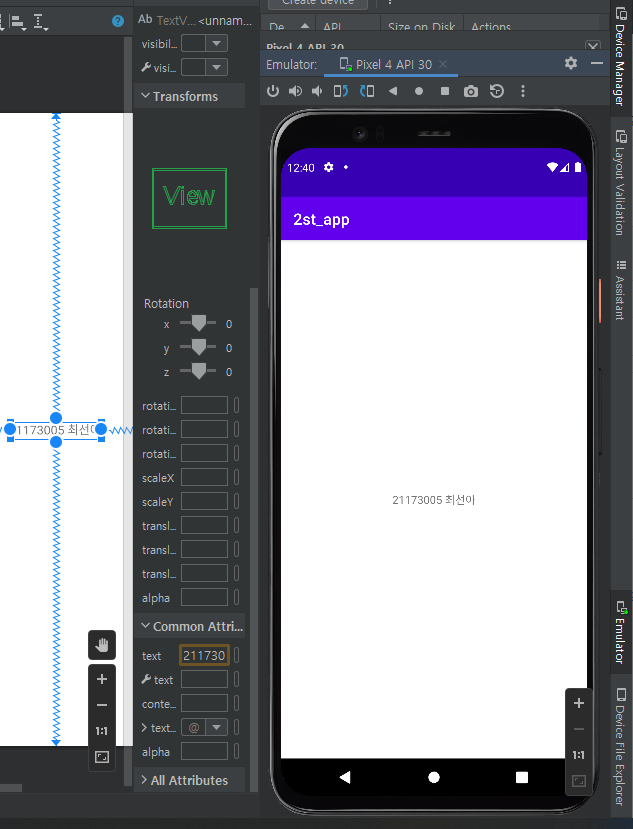</img>

# 3주차(2022-03-22)
 - 네이버앱 버튼과 전화걸기 버튼 만들기
 
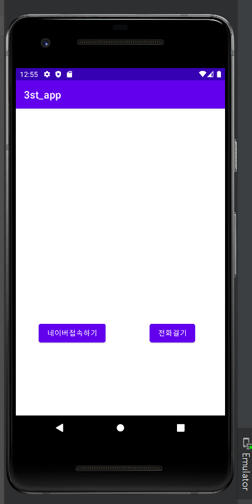</img>
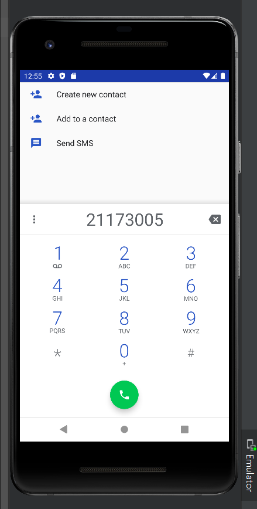</img>
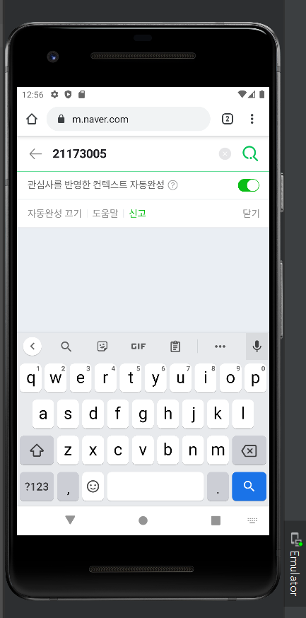</img>

# 4주차(2022-03-29)
 - 토스트 
 
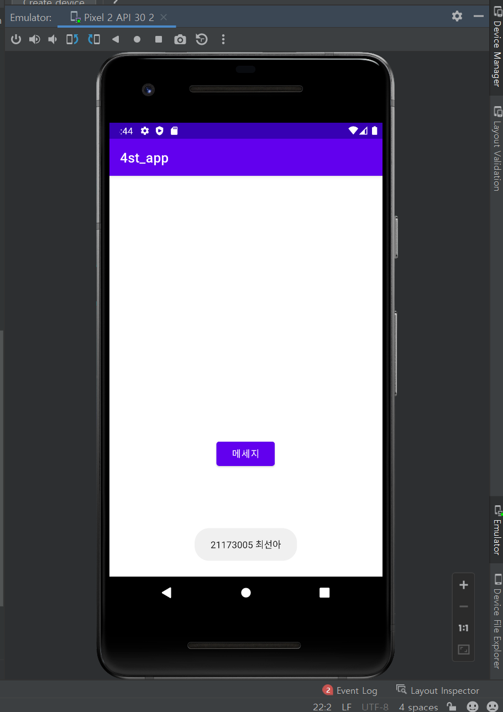</img>

# 5주차(2022-04-05)
 - 이미지 바꾸기 버튼

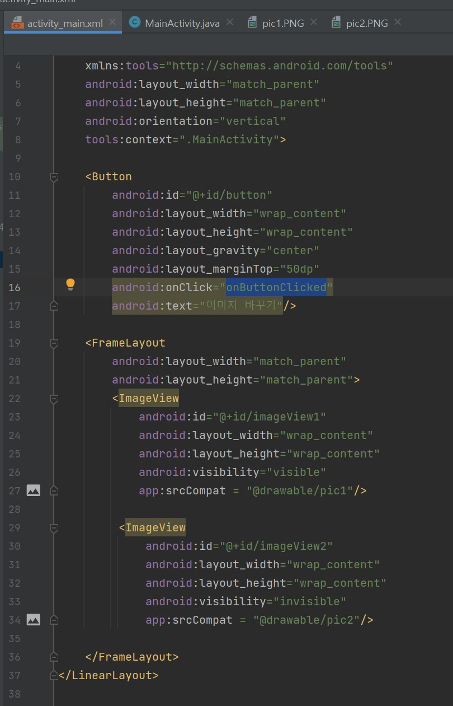</img>
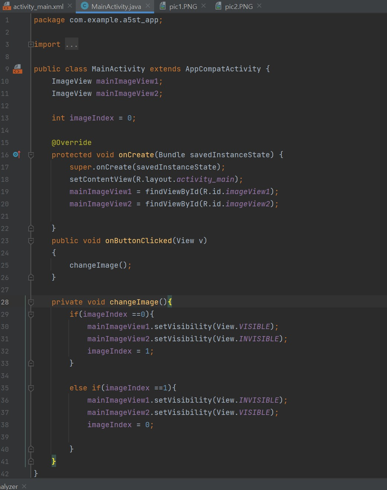</img>
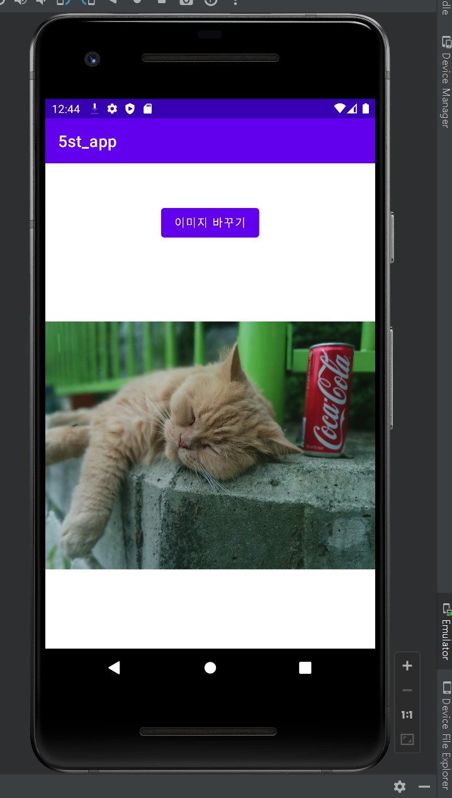</img>
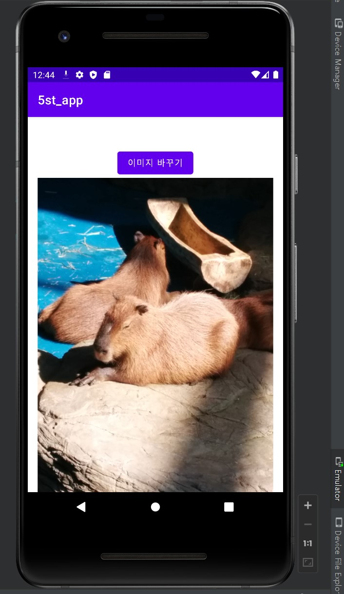</img>

# 6주차(2022-04-13)
 - 이미지 스크롤 & 토스트(이미지 가로 세로)

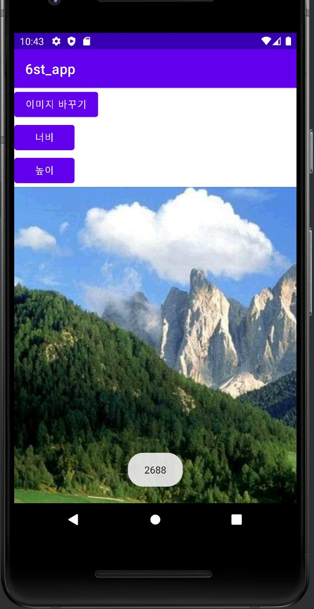</img>
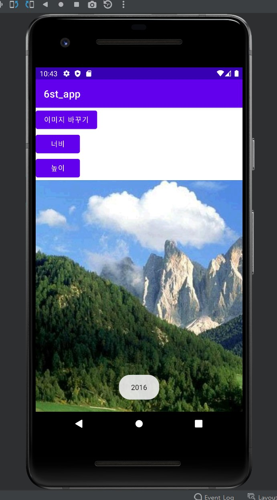</img>

